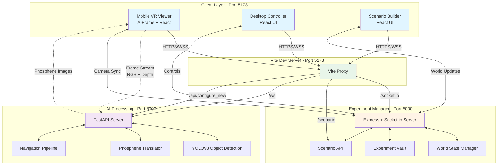

# Dawn Pilot – AfterDawn

A comprehensive web platform for building and managing **VR experiments for bionic eye systems**, enabling researchers to create immersive scenarios, simulate phosphene vision, and analyze subject performance in real-time.

---

## 📋 Table of Contents

1. [⚡ Experiment Run & Execution Protocol](#-experiment-run--execution-protocol)
2. [Overview](#-overview)
3. [Architecture](#-architecture)
4. [System Components](#-system-components)
5. [Getting Started](#-getting-started)
6. [Naming Conventions](#-naming-conventions)
7. [Development Guide](#-development-guide)
8. [API Documentation](#-api-documentation)

---

## ⚡ Experiment Run & Execution Protocol

> [!IMPORTANT]
> Follow these exact steps prior to conducting any live VR experiment trial.

### 1. Network & System Preparation
- **Shared Network**: Connect both the laptop and the phone to the **same Wi-Fi** or connect the phone directly to the **laptop's mobile hotspot**.
- **System Optimization**:
  - Close background applications and unused browser tabs on the laptop.
  - Put the mobile phone on **Do Not Disturb** mode.
  - Open the browser in **Incognito mode** to avoid cache/extension interference.

### 2. Launch Backend Servers
- **AI Vision & Phosphene Backend** (FastAPI - Port 8000):
  - Ensure the latest **YOLO Model** (`object_path_detection/models/yolo_our_data_50.pt`) and **Freepath Model** (`object_path_detection/models/final_deeplabv3_footpath.pth`) are in place.
  - Confirm `"debug_mode": false` in `config/navigation_config.json`.
  ```powershell
  cd Back-End\fast_api
  ..\..\.venv\Scripts\Activate.ps1
  python main.py
  ```
- **Experiment Manager Backend** (Node/Express - Port 5000):
  ```powershell
  cd Back-End\Experiment-Manager
  pnpm dev
  ```

### 3. Build & Launch Frontend
For best runtime performance during live trials, run the production preview:
1. Build the frontend:
   ```powershell
   cd Front-End\Main-Main-App\DawnPilotFrontEnd
   pnpm build
   ```
2. Ensure static 3D models are available in the build (`copy public/models to dist/models` if not bundled).
3. Start the hosted preview server:
   ```powershell
   pnpm preview --host
   ```
   *(Alternatively, for active development, run `pnpm dev --host`)*

### 4. Connect Phone (Mobile VR) & Laptop Dashboard
1. **Network IP URL**: Note the LAN IP output from the server (e.g., `https://192.168.x.x:5173` — **do not use `localhost` on the phone**).
2. **Pairing**:
   - On Laptop: Open `https://localhost:5173/connect` to display the QR code.
   - On Phone: Scan the QR code (or navigate to `https://192.168.x.x:5173/mobile`) to open the **Mobile VR Viewer**.
3. **Researcher Dashboard**:
   - On Laptop: Open `https://localhost:5173/lite` (**Researcher Lite** view for minimal overhead).
4. **Verification & Setup**:
   - Verify camera pose & state synchronization between phone and laptop.
   - Adjust experiment parameters in the **S Tab** (Settings) on the left sidebar of the Researcher View.
   - Center the phone inside the VR headset (align the center screen division line with the headset lenses).

### 5. VR Controller / Gamepad Setup
- **Controller Test**: Open `Front-End/gamepad_test.html` in browser to confirm button/joystick mapping.
- **Windows Game Controller Check**: Press `Win + R` → type `joy.cpl` → press Enter to check controller detection.
- **Troubleshooting**:
  - If unresponsive: Unpair and re-pair Bluetooth device in Windows settings.
  - If input is not captured in Chrome: Restart the browser.
  - If using keyboard mapping bridge: Run `python Back-End\gamepad_to_keyboard.py`.

---

## 🎯 Overview

Dawn Pilot is a multi-layered application that combines:
- **VR Scene Builder**: Create 3D environments using A-Frame
- **Phosphene Vision Simulation**: Real-time AI-powered object detection and vision translation
- **Experiment Management**: Record, replay, and analyze user interactions
- **Multi-Device Sync**: Synchronize mobile VR headsets with desktop control panels

### Key Features

- 🥽 **VR-First Design**: Built on A-Frame/WebGL for immersive experiences
- 🤖 **AI-Powered Vision**: YOLOv8 object detection with phosphene translation
- 🔄 **Real-Time Sync**: Socket.io and WebSocket for instant multi-device communication
- 📊 **Experiment Recording**: Capture and analyze subject performance data
- 🎨 **Scenario Builder**: Drag-and-drop interface for creating test environments
- 🎮 **Gamepad Support**: VR controller and gamepad input handling

---

## 🏗 Architecture

### High-Level Architecture Diagram



### Connection Flow Diagram

```
┌─────────────────────────────────────────────────────────────────────────┐
│                    CLIENT (Browser) - Port 5173                         │
├─────────────────────────────────────────────────────────────────────────┤
│                                                                         │
│  ┌──────────────┐    ┌──────────────┐    ┌──────────────┐            │
│  │ Mobile VR    │    │ Desktop      │    │ Scenario     │            │
│  │ Viewer       │    │ Controller   │    │ Builder      │            │
│  │ (A-Frame)    │    │ (React)      │    │ (React)      │            │
│  └──────────────┘    └──────────────┘    └──────────────┘            │
│         │                   │                    │                     │
│         └───────────────────┴────────────────────┘                     │
│                             │                                          │
│                             ▼                                          │
│                    ┌─────────────────┐                                 │
│                    │ Vite Dev Proxy  │                                 │
│                    └─────────────────┘                                 │
│                             │                                          │
└─────────────────────────────┼──────────────────────────────────────────┘
                              │
                    ┌─────────┴──────────┐
                    │                    │
                    ▼                    ▼
    ┌───────────────────────┐  ┌──────────────────────┐
    │ Experiment Manager    │  │ FastAPI AI Server    │
    │ Port 5000             │  │ Port 8000            │
    ├───────────────────────┤  ├──────────────────────┤
    │                       │  │                      │
    │ • Socket.io Server    │  │ • WebSocket Server   │
    │ • World State Mgmt    │  │ • YOLOv8 Detection   │
    │ • Camera Sync         │  │ • Phosphene Pipeline │
    │ • Scenario CRUD       │  │ • GPU Processing     │
    │ • Experiment Record   │  │                      │
    │                       │  │                      │
    └───────────────────────┘  └──────────────────────┘
```

### Data Flow: Phosphene Vision Pipeline

```
┌─────────────────────────────────────────────────────────────────┐
│                    MOBILE VR VIEWER                            │
├─────────────────────────────────────────────────────────────────┤
│                                                                 │
│  1. A-Frame WebGL Renderer                                     │
│     ├─> Capture RGB Frame (640x480)                           │
│     └─> Capture Depth Buffer (640x480)                        │
│                                                                 │
│  2. Frame Processing                                           │
│     ├─> Convert to JPEG Blobs                                 │
│     └─> Encode to Base64                                      │
│                                                                 │
│  3. WebSocket Send (ws://localhost:8000/ws/navigation-phosphene)│
│     {                                                          │
│       "type": "frame",                                         │
│       "frame_id": 42,                                          │
│       "rgb": "base64...",                                      │
│       "depth": "base64...",                                    │
│       "stage": "phosphene"                                     │
│     }                                                          │
│                                                                 │
└────────────────────────────┬────────────────────────────────────┘
                             │ WebSocket
                             ▼
┌─────────────────────────────────────────────────────────────────┐
│                    FASTAPI AI SERVER                           │
├─────────────────────────────────────────────────────────────────┤
│                                                                 │
│  1. Receive & Decode                                           │
│     └─> Base64 → NumPy Arrays                                 │
│                                                                 │
│  2. YOLOv8 Object Detection                                    │
│     └─> Detect objects in RGB frame                           │
│                                                                 │
│  3. Depth Assignment                                           │
│     └─> Map depth values to detected objects                  │
│                                                                 │
│  4. Navigation Pipeline                                        │
│     ├─> Freepath Detection                                    │
│     ├─> Occupancy Mapping                                     │
│     └─> Distance Calculation                                  │
│                                                                 │
│  5. Phosphene Translation                                      │
│     ├─> Select Important Objects (k_min, k_max, t_min)       │
│     ├─> Generate Stimulation Amplitudes                       │
│     └─> Render Phosphene Shapes                              │
│                                                                 │
│  6. WebSocket Send                                             │
│     {                                                          │
│       "type": "result",                                        │
│       "frame_id": 42,                                          │
│       "phosphene_image": "base64...",                          │
│       "detections": [...],                                     │
│       "freepath_circle": {...}                                │
│     }                                                          │
│                                                                 │
└────────────────────────────┬────────────────────────────────────┘
                             │ WebSocket
                             ▼
┌─────────────────────────────────────────────────────────────────┐
│                    MOBILE VR VIEWER                            │
├─────────────────────────────────────────────────────────────────┤
│                                                                 │
│  1. Receive Result                                             │
│     └─> Parse JSON                                            │
│                                                                 │
│  2. Decode Phosphene Image                                     │
│     └─> Base64 → Blob → Image URL                            │
│                                                                 │
│  3. Render to Canvas                                           │
│     └─> Draw phosphene visualization                          │
│                                                                 │
│  4. Update A-Frame Texture                                     │
│     └─> Apply phosphene overlay to VR view                    │
│                                                                 │
└─────────────────────────────────────────────────────────────────┘
```

---

## 🔧 System Components

### Frontend (`Front-End/Main-Main-App/DawnPilotFrontEnd`)

**Technology Stack**: React 19, TypeScript, A-Frame 1.7, Socket.io-client, Vite

**Key Pages**:
- **Mobile Viewer** (`/mobile`): VR headset view with phosphene vision
- **Desktop Controller** (`/desktop`): Control panel for experiment management
- **Scenario Builder** (`/builder`): Visual editor for creating 3D environments
- **Connect Page** (`/connect`): QR code-based device pairing

**Custom Hooks**:
- `useCameraSync`: Real-time camera position synchronization
- `useAiStream`: WebSocket connection to AI processing pipeline
- `useScenarioWorld`: 3D world state management
- `useComponentManager`: Entity CRUD operations
- `useFrameBuffer`: RGB + Depth frame capture from A-Frame

### Experiment Manager (`Back-End/Experiment-Manager`)

**Technology Stack**: Node.js, Express, TypeScript, Socket.io, WebSocket

**Responsibilities**:
- **World State Management**: Maintain 3D scene state and sync across clients
- **Real-Time Communication**: Socket.io server for multi-device sync events
- **Scenario CRUD**: REST API for saving/loading experiment scenarios
- **Experiment Recording**: Track user interactions, collisions, and camera movements
- **Client Registry**: Manage connected mobile and desktop clients

**Key Files**:
- `api.ts`: Main server setup and Socket.io handlers
- `world_Manager.ts`: 3D world state CRUD operations
- `Scenario-Builder/ExperimentVault.ts`: Experiment recording system

**API Endpoints**:
- `GET /health`: Health check
- `POST /scenario/save`: Save scenario configuration
- `GET /scenario/load`: Load scenario by ID
- Socket Events: `camera:update`, `vision-mode:update`, `experiment:collision`, etc.

### AI Processing Backend (`Back-End/fast_api`)

**Technology Stack**: Python 3, FastAPI, PyTorch, YOLOv8, OpenCV, Uvicorn

**Responsibilities**:
- **Object Detection**: YOLOv8-based real-time detection on GPU
- **Depth Processing**: Depth map analysis for distance calculations
- **Phosphene Translation**: Convert detected objects to bio-compatible visual stimulation
- **Navigation Pipeline**: Freepath detection and occupancy mapping
- **WebSocket Streaming**: Real-time frame processing

**Key Modules**:
- `main.py`: FastAPI application setup
- `services/NavigationDetectorService.py`: Main AI pipeline orchestrator
- `detection/`: YOLOv8 detector implementation
- `translation/`: Phosphene translation algorithms
- `api/nav_phosphene_ws.py`: WebSocket handler for frame processing

**API Endpoints**:
- `WebSocket /ws/navigation-phosphene`: Main processing endpoint
- `POST /api/configure_new`: Configure AI parameters
- `GET /health`: Service health check
- `GET /test`: Test page for WebSocket connection

**Configurable Parameters**:
- `conf_threshold`: Detection confidence (0.0-1.0)
- `t_min`: Minimum object importance score
- `k_min`: Minimum objects to select
- `k_max`: Maximum objects to select

---

## 🚀 Getting Started

### Prerequisites

- **Node.js** 18+ (Frontend & Experiment Manager)
- **Python** 3.9+ (AI Backend)
- **pnpm** (Package manager)
- **CUDA-capable GPU** (Recommended for AI processing)

### Installation

#### 1. Install Dependencies

**Frontend:**
```bash
cd Front-End/Main-Main-App/DawnPilotFrontEnd
pnpm install
```

**Experiment Manager:**
```bash
cd Back-End/Experiment-Manager
pnpm install
```

**AI Backend:**
```bash
cd Back-End/fast_api
python -m venv venv
.\venv\Scripts\Activate.ps1
pip install -r requirements.txt
```

#### 2. Start Development Servers

**Option A: Start All Services** (Recommended)
```bash
# From workspace root
# Run the "dev:all" task from VS Code or:
```
Use VS Code's task runner to start `dev:all` which launches all three servers in parallel.

**Option B: Start Individually**

```bash
# Terminal 1: Frontend (Port 5173)
cd Front-End/Main-Main-App/DawnPilotFrontEnd
pnpm dev

# Terminal 2: Experiment Manager (Port 5000)
cd Back-End/Experiment-Manager
pnpm dev

# Terminal 3: AI Backend (Port 8000)
cd Back-End/fast_api
.\venv\Scripts\Activate.ps1
python main.py
```

### Access Points

- **Frontend**: `https://localhost:5173`
- **Experiment Manager**: `http://localhost:5000`
- **AI Backend**: `http://localhost:8000`
- **AI Test Page**: `http://localhost:8000/test`

### Quick Test

1. Open `https://localhost:5173` in your browser
2. Navigate to `/mobile` for VR view or `/desktop` for control panel
3. The frontend will automatically proxy requests to backend services
4. Check browser console for connection status:
   - `✅ Socket.IO connected` (Experiment Manager)
   - `🟢 [AI Stream] Connected` (AI Backend)

---

## 📏 Naming Conventions

### 📂 Folder Names
- Start each word with a **capital letter**
- Replace spaces with a **dash (`-`)**
- Example: `Data Models` → `Data-Models`

### 📄 File Names

#### 🔧 Back-End (TypeScript)
- Use `api_Main` style (snake + Pascal hybrid)
- Example: `api_Experiment.ts`, `world_Manager.ts`

#### 🐍 Back-End (Python)
- Use `snake_case` for modules
- Example: `websocket_routes.py`, `navigation_detector.py`

#### 🎨 Front-End (React)
- **Components**: Start with capital letter
  ```
  MyComponent.tsx
  WorldRenderer.tsx
  ```
- **Custom Hooks**: Use `useHook` PascalCase style
  ```
  useFetchData.ts
  useCameraSync.ts
  ```
- **Utilities**: Use camelCase
  ```
  apiHelpers.ts
  frameBuffer.ts
  ```

---

## 💻 Development Guide

### Project Structure

```
Dawn-Pilot--AfterDawn/
├── Front-End/
│   └── Main-Main-App/
│       └── DawnPilotFrontEnd/
│           ├── src/
│           │   ├── pages/           # Main application pages
│           │   ├── components/      # Reusable React components
│           │   ├── hooks/           # Custom React hooks
│           │   ├── ApiConfig.ts     # API endpoint configuration
│           │   └── main.tsx         # Application entry point
│           ├── vite.config.ts       # Vite proxy configuration
│           └── package.json
│
├── Back-End/
│   ├── Experiment-Manager/
│   │   ├── api.ts               # Express server + Socket.io
│   │   ├── world_Manager.ts     # World state management
│   │   ├── routes/              # REST API routes
│   │   ├── Scenario-Builder/    # Experiment recording
│   │   └── package.json
│   │
│   └── fast_api/
│       ├── main.py              # FastAPI application
│       ├── api/
│       │   ├── routes.py        # REST endpoints
│       │   └── nav_phosphene_ws.py  # WebSocket handler
│       ├── services/
│       │   └── NavigationDetectorService.py
│       ├── detection/           # YOLOv8 integration
│       ├── translation/         # Phosphene algorithms
│       └── requirements.txt
│
├── testing_sequence/            # Test datasets
├── YOLO_Dataset/               # Training data
└── README.md                   # This file
```

### Key Configuration Files

#### Frontend Proxy (`vite.config.ts`)

```typescript
proxy: {
  '/socket.io': {
    target: 'http://localhost:5000',  // Experiment Manager
    ws: true
  },
  '/scenario': {
    target: 'http://localhost:5000',  // Scenario API
  },
  '/ws': {
    target: 'http://localhost:8000',  // AI WebSocket
    ws: true
  },
  '/api/configure_new': {
    target: 'http://localhost:8000',  // AI Configuration
  }
}
```

#### API Configuration (`ApiConfig.ts`)

```typescript
export const URLS = {
  SYNC_SOCKET: `${protocol}//${hostname}${port}`,  // Proxied to :5000
  SCENARIO_API: `/scenario`,                        // Proxied to :5000
  AI_STREAM: `${wsProtocol}//${hostname}${port}`   // Proxied to :8000
};
```

### Common Development Tasks

#### Adding a New Scenario Entity
1. Update `world_Manager.ts` (Experiment Manager)
2. Add entity to frontend component library
3. Update Socket.io sync events if needed

#### Modifying AI Parameters
1. Update `NavigationDetectorService.py`
2. Expose parameters in `/api/configure_new` endpoint
3. Add UI controls in Desktop Controller

#### Adding New Vision Modes
1. Extend `translation/` algorithms (AI Backend)
2. Add mode selector in Mobile Viewer
3. Sync mode state via Experiment Manager

### Debugging

**Frontend Console Outputs**:
```
✅ Socket.IO connected          # Experiment Manager connected
🟢 [AI Stream] Connected        # AI Backend connected
📸 Frame captured: 640x480      # Frame processing active
```

**Backend Logs**:
```
Client connected: abc123         # New Socket.io client
🟢 [AI] Processing frame 42     # AI pipeline active
✅ NavigationDetectorService ready  # AI service initialized
```

---

## 📚 API Documentation

### Experiment Manager API (Port 5000)

#### REST Endpoints

**`GET /health`**
- Returns service health status

**`POST /scenario/save`**
- Body: `{ name: string, world: WorldState }`
- Saves scenario configuration to disk

**`GET /scenario/load?id=<scenario-id>`**
- Returns saved scenario configuration

#### Socket.io Events

**Client → Server:**
- `client:register` - Register client type (mobile/desktop)
- `camera:update` - Send camera position/rotation
- `vision-mode:update` - Change vision mode
- `experiment:collision` - Report collision event
- `throttle:update` - Sync frame throttle settings

**Server → Client:**
- `camera:updated` - Broadcast camera changes
- `vision-mode:changed` - Broadcast vision mode changes
- `alert:status` - System notifications
- `world-dimensions:changed` - World size updates

### AI Backend API (Port 8000)

#### REST Endpoints

**`GET /health`**
- Returns AI service health and readiness

**`POST /api/configure_new`**
```json
{
  "conf_threshold": 0.2,
  "t_min": 0.3,
  "k_min": 1,
  "k_max": 5
}
```
- Configure AI detection and translation parameters

#### WebSocket Endpoints

**`WebSocket /ws/navigation-phosphene`**

**Send (Client → Server):**
```json
{
  "type": "frame",
  "frame_id": "42",
  "rgb": "base64-encoded-jpeg...",
  "depth": "base64-encoded-jpeg...",
  "stage": "phosphene",
  "debug": false
}
```

**Available Stages**:
- `detector`: Object detection with bounding boxes
- `translator`: Simplified canonical shapes
- `pre_phosphene`: Center cropped 128x128
- `phosphene`: Full phosphene rendering (default)

**Receive (Server → Client):**
```json
{
  "type": "result",
  "frame_id": "42",
  "phosphene_image": "base64-encoded-png...",
  "detections": [
    {
      "class": "person",
      "confidence": 0.95,
      "bbox": [x, y, w, h],
      "depth": 2.5
    }
  ],
  "freepath_circle": {
    "center": [x, y],
    "radius": 150
  },
  "processing_time_ms": 45.3
}
```

---

## 🔬 Testing

### Test Datasets

- `testing_sequence/`: Pre-captured RGB/Depth/Label sequences
- `testing_sequence/detections_json/`: Ground truth detection data

### Manual Testing

1. **AI Pipeline Test Page**: `http://localhost:8000/test`
   - Upload test images or use webcam
   - View detection results and phosphene output
   - Test different pipeline stages

2. **Full Integration Test**:
   - Open Mobile Viewer on VR headset
   - Open Desktop Controller on PC
   - Load a test scenario
   - Verify camera sync and phosphene rendering

---

## 📝 Additional Documentation

- **[ARCHITECTURE_ANALYSIS.md](ARCHITECTURE_ANALYSIS.md)**: Deep dive into communication protocols
- **[IMPLEMENTATION_GUIDE.md](IMPLEMENTATION_GUIDE.md)**: Detailed implementation notes
- **[CODE_REVIEW.md](CODE_REVIEW.md)**: Code quality analysis
- **[FIXES_APPLIED.md](FIXES_APPLIED.md)**: Bug fixes and improvements log

---

## 🤝 Contributing

When contributing to this project:
1. Follow the naming conventions outlined above
2. Test on both mobile and desktop clients
3. Verify AI pipeline integration
4. Update documentation for API changes
5. Check console for connection errors

---

## 📄 License

Internal research project - Bionic Eye Research Team

---

## 🔗 Quick Links

- [A-Frame Documentation](https://aframe.io/docs/)
- [FastAPI Documentation](https://fastapi.tiangolo.com/)
- [Socket.io Documentation](https://socket.io/docs/)
- [YOLOv8 Documentation](https://docs.ultralytics.com/)
